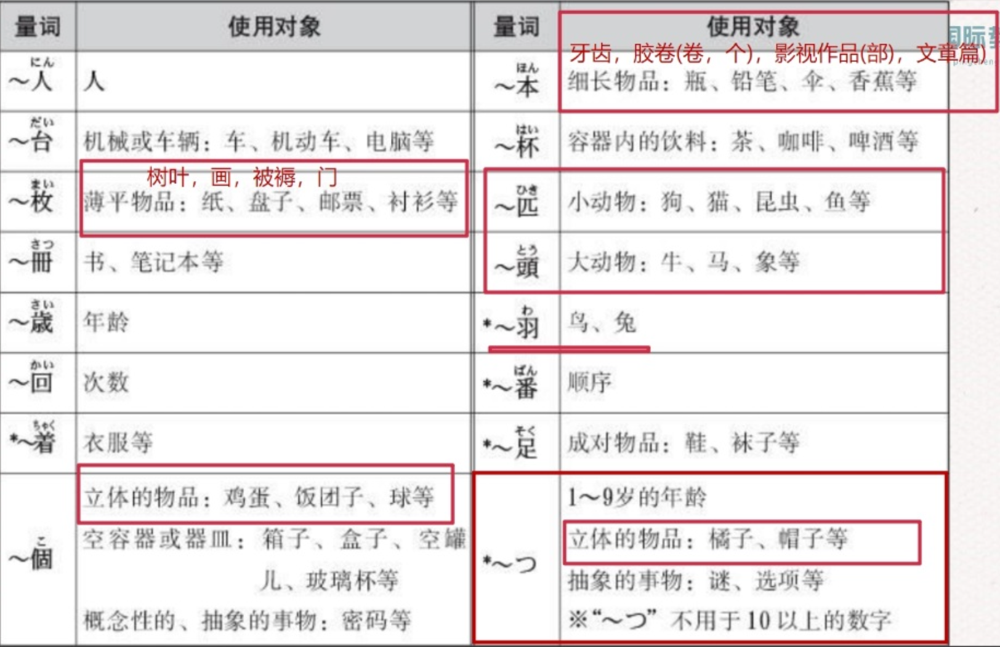

## 4.1 の
### 句形
N1 の N2  

### 解释
「の」有两种用法，第一种表示什么的种类、属性、性质等，译作「的」；第二种表示从属，N1 与 N2 同谓语，此时不能译作「的」。  

### 例子
- バナナの味（香蕉的味道）  
- 日本語の授業（日本语授课）  

---

## 4.2 も
### 句形
N1 は N2 です、N3 も N2 です。  

### 解释
「も」译作「也」。  

### 例子
張さんは学生です、パクさんも学生です。  

---

## 4.3 と
### 句形
N1 と N2  

### 解释
「と」表示并列，译作「和」。  

### 例子
りんごとなしは果物です。  

---

## 4.4 が
### 4.4.1 表示逆接、转折
#### 句形
A が、B。  

#### 解释
译作“虽然……但是……”。 

#### 例子  
日本語は難しいですが、おもしろいです。  

---

### 4.4.2 提示能力・情感・好恶等作用的对象
#### 句形  
N1 は N2 が 形／動詞。  

### 解释  
- 当谓语表示「分かる」、「できる」等能力，「怖い」等情感，以及「好き」、「嫌い」、「上手」、「下手」等好恶、擅长时，助词「が」用于提示作用的对象 N2，而不用「を」。  
- 若谓语为形容词，句末接「です」；若为动词，一般用ます形结尾。  

### 例子  
1. 私は数学が苦手です。  
2. 王さんは虫が怖いです。  
3. 李さんは英語が分かります。  

---

## 4.5 に
### 4.5.1 表示具体的时间
#### 句形
- N（時間）に V。

#### 解释
- 强调事情发生的具体时间，接在“绝对时间”的后面。
- 绝对时间（一般要加「に」）：
  1) 带数字的时间：〜年・〜月・〜日・〜時・〜分 等。  
  2) 节假日/生日/寒暑假：休み・クリスマス・誕生日 等。  
  3) 星期：月曜日〜日曜日。
- 相对时间（一般不加「に」）：今日・明日・昨日・今朝・今晩・毎朝・毎晩・毎日 等。

#### 例子
1. 授業は午前11時に始まります。  
2. 休みに京都へ行きます。  
3. 日曜日に友だちと映画を見ます。

---

### 4.5.2 表示移动的方向与到达的目的地
#### 句形
N（场所）へ／に 行きます／来ます／帰ります。  

#### 解释
- 「へ」读作「e」，侧重“朝向”的方向。  
- 「に」表示到达点、目的地。与「行く／来る／帰る」搭配时，「へ／に」多数场合可互换，语气细微不同：  
  - 用「へ」时更像“往……”这一方向移动；  
  - 用「に」时更像“到……这一点上”。  
- 表示朝某个方位转弯时常用「へ」：右へ曲がります（向右转）。

#### 例子
1. 友だちは 日本へ 来ました。  
   朋友来了日本。
2. 公園に 行きます。  
   去公园。
3. 次の角を 右へ 曲がってください。  
   请在下一个路口向右转。
4. 家の近くに 行きます。  
   去家附近。

---

### 4.5.3 表示动作“指向/作用到”的对象
#### 句形
N（主语）は　N（对象）に　（N を）　V　ます。

#### 解释
- 「に」标记动作“指向/作用到”的对象。
- 表示“双方一起做某事”常用「と」：友だちと 話します。  
  注意「会う」搭配「に」（对方是“见面的对象/目标”）：友だちに 会います。

#### 例子
1. 先生に 電話します。  
   我给老师打电话。
2. 友だちに 会います。  
   我去见朋友。（对象用「に」）
3. 友だちと 話します。  
   我跟朋友聊天。（共同参与者用「と」）

---

### 4.5.4 表示移动的目的
### 句形
- Vます词干 に 行きます／来ます／帰ります/戻る。

### 解释
- 表示“去/来/回去做某事”的目的。
- 常与表示移动的动词「行く・来る・帰る・戻る」连用。

### 例子
1. 京都へお寺を見に行きます。
2. 山田さんは飲みに行きます。
3. 日本へ留学に行きます。

---

## 4.6 を
### 4.6.1 表示离开/经过的场所・交通工具
#### 句形
- N（場所・乗り物）を 出る／降りる／離れる。  
- N（場所）を 散歩する。

#### 解释
- 表示离开的地点、场所或交通工具（例：家を出る／電車を降りる／国を離れる）。  
- 也可表示经过、通过的场所（例：公園を散歩する）。

### 例子
1. 毎朝9時に家を出ます。  
2. 電車を降ります。  
3. 私は毎日公園を散歩します。

---

## 4.7 「から」与「まで」

### 句形
- N1（時間／場所）から N2（時間／場所）まで V／です。  
- N（時間／場所）から V／です。  
- N（時間／場所）まで V／です。

### 解释
- 「から」：事件、动作、状态等的起点，意为“从……”。  
- 「まで」：终点，意为“到……为止”。  
- 二者可合用，也可单独使用。

### 例子
1. 金曜日から日曜日まで休みです。  
2. 私は中国から来ました。  
3. 家から歩きます。  
4. 駅まで歩きます。

---

## 4.8 で
### 4.8.1 表示交通手段
#### 句形
N（交通手段）で 行きます／来ます／帰ります。  

#### 解释
- 「で」表示手段、工具，接在交通工具名词后，表示“乘/坐/骑……去”。例如：バスで、電車で、自転車で、車で、飛行機で。
- 表示“步行”时不用「で」，而用「歩いて」（动词「歩く」的て形）作方式状语：歩いて行きます。
- 常与表示移动的动词搭配：行く・来る・帰る。

#### 例子
1. 毎日 自転車で 大学へ 行きます。  
   每天骑自行车去大学。
2. 東京駅まで バスで 行きます。  
   坐公交到东京站。
3. 歩いて 帰ります。  
   走路回去。
4. 飛行機で 国へ 帰ります。  
   坐飞机回国。

---

### 4.8.2 表示在某地做某事
#### 句形
N（工具・方式）で + V。

#### 解释
表示动作发生的场所。

#### 例子
1. 教室で 勉強します。  
   在教室学习。（场所）

---

### 4.8.3 表示用工具/方式
#### 句形
N（工具/方式）で + V。

#### 解释
表示使用的工具/方式。

#### 例子
1. 箸で ご飯を 食べます。  
   用筷子吃饭。（工具/方式）

---

### 4.8.4 表示看得出的原材料
#### 句形
N（看得出的材料）で + 作ります。

#### 例子
1. いすは 木で 作られています。／コロッケは 豆で 作ります。  
   椅子是用木头制成的／可乐饼用豆子做。（材料）

---

### 4.8.5 表示动作主体的构成（人数・群体・状态・数量）  

#### 句形  
N（人数／群体/数量）で + V。

#### 解释  
- 「Nで」表示“以某种成员构成/人数/数量/整体状态”为单位来进行动作，强调“作为一个整体”去做某事。  
- 和「Nと（いっしょに）」相比，「Nで」更强调“以该集体为单位”；「Nと」强调“与某人一起”。  

#### 例子  
1. 一人で 旅行します。  
   一个人去旅行。  
2. 全員で 写真を 撮ります。  
   全体一起拍照。  
3. 家族で 日本へ 行きました。  
   和全家一起去了日本。  
4. 三人で 映画を 見ます。  
   三个人去看电影。  
5. このケーキは３つで１５元です。（「で」用来限定数量，译作“总计”）
6. このケーキは１つ６元です。（1个不用で）

---

## 4.9「や／など」

### 句形  
N1や N2（など）  

### 解释  
- 「や（など）」表示“部分列举”，举出一两项代表，暗示还有其他：N1呀N2等。  
- 「と」表示“完全列举/并列”，把所有项目都列出来；也可连接人名词表示“和……（一起）”。  

### 例子  
1. かばんに 本や ノート（など）が あります。  
   包里有书、笔记本（等等）。  

---

## 4.10 「〜とか〜とか」
### 句形
- N （场所）に　A とか　B とか　います・あります。
- V１　とか　V２　とか　します。

### 解释
表示部分列举，搭配“某地有某物”的用法；如果在谓语部分列举动作时，可以写成“V１　とか　V２　とか　します”的形式。

### 例子
1. 机の上にペンとかのりとかがあります。
2. 明日、友達とカラオケに行くとか買い物するとかします。

---

## TODO 101.1「ぐらい／くらい」与「ちょっと」

### 句形
- N（时间量／金额 等） + 動詞  
- N（时间量／金额 等） + ぐらい／くらい + 動詞  
- N（时间量） + ちょっと

### 解释
- 表示动作持续的时间或花费金额时，数量词后通常不加助词：  
- 「ぐらい／くらい」表示“大约、左右”。  
- 「N + ちょっと」表示“稍微多一点儿”，「少し／ちょっと」也可作副词表示“稍微、一点儿”。

### 例子
1. 三時間 勉強しました。  
   学了三小时。
2. 三時間ぐらい 勉強しました。  
   学了大约三小时。
3. 三時間ちょっと 勉強しました。  
   学了三个小时多一点。
4. 15000円ぐらい かかりました。  
   花了15000日元左右。

---

## TODO 101.2「いっしょに」／「一人で」

### 句形
- N（人）と（いっしょに） + 動詞  
- 一人で + 動詞

### 解释
- 助词「と」表示共同参与者，相当于“和……一起”。常与「いっしょに」搭配以强调“一起”。  
- 「一人で」表示“独自、一个人”做某事，不涉及共同参与者。

### 例子
1. 友達と（いっしょに） 図書館へ 行きます。  
   和朋友一起去图书馆。
2. 私は 一人で 来ました。  
   我一个人来的。
3. 来週、小野さんと いっしょに 新幹線で 東京から 大阪へ 行きます。  
   我下周和小野一起坐新干线从东京去大阪。

---

## TODO 101.3「〜ましょう／〜ませんか／〜ましょうか」

### 句形
- Vます形 + ましょう。  
- Vます形 + ませんか。  
- Vます形 + ましょうか。

### 解释
表示劝诱与提议，委婉的程度从低到高：
- 「〜ましょう」：直接提议“我们一起…吧”。  
- 「〜ましょうか」：提议或主动提供帮助，“要不要我来…？” 常与「私が〜ましょうか」搭配。
- 「〜ませんか」：委婉邀请“要不要一起…？”  

### 例子
1. いっしょに 食堂へ 行きましょう。  
   一起去食堂吧。
2. いっしょに 食堂へ 行きませんか。  
   要不要一起去食堂？
3. 先生、荷物は 私が 持ちましょうか。  
   老师，您的行李我来拿吧。（主动提出帮助）

---

## TODO 101.4 「疑问词 + も + 否定」的

### 句形
- 何も + Vません／ありません
- だれも + Vません／いません
- どこへも／どこにも + 行きません／行きませんでした

### 解释
- “疑问词 + も + 否定”表示“全都不/没有”，全盘否定。  
  常见：何も（什么都不）、だれも（谁也不）、どこも（哪儿也不）。
- 注意「も」在否定句中才有“全盘”之意；肯定句中的「も」多为“也/都”。

### 例子
1. 今日は 何も 食べません。  
   我今天什么都不吃。
2. この部屋には だれも いません。  
   这个房间里谁也没有。
3. 週末は どこへも 行きません。  
   周末哪儿也不去。
4. かばんの中に 何も ありません。  
   包里什么都没有。

---

### TODO 101.5 数量词

### 句形
- N + 数量词 + V
- N が／を 数量 V（位置可前后灵活：本を三冊買いました／三冊本を買いました）

### 解释
根据名词的种类选择相应的数量词（助数詞）。

### 例子
1. りんごを三つ買いました。  
2. ペンを二本買いました。  
3. 部屋に二人とテレビが一台あります。  
4. このケーキは３つで１５元です。  
   このケーキは１つ６元です。
   
---

### TODO 101.5 频率表达（周期に回数）

### 句形
- N（周期）に N（回数） V  
  例：一時間に一回V／一週間に三回V／一ヶ月に二回V
- 毎N ＋ N（回数） V（毎〜后一般不用「に」）  
  例：毎日一回V／毎月二回V

### 解释
- 「に」接在表示时间长度或周期的名词后，表“以……为单位，每……多少次”。  
- 使用「毎〜」时通常不加「に」：毎日一回（×毎日に一回）。  
- 说“每月两次”可说「月に二回」或「一月に二回」；「毎月二回」也可。

### 例子
1. 一時間に一回、ベルが鳴ります。  
2. 私はサークルの仲間と月に二回映画を見ます。  
3. 一週間に何回部屋の掃除をしますか。  
   三回します（／三回です）。